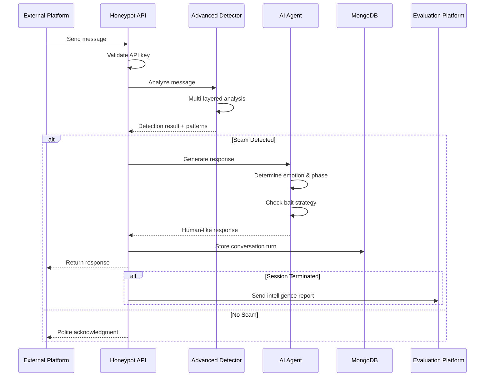

# 🐝 Agentic Honey-Pot System

> **AI-Powered Scam Detection & Intelligence Extraction Platform**

An advanced backend service that autonomously detects scam messages, engages scammers in realistic multi-turn conversations, and extracts valuable intelligence—all while maintaining perfect human-like behavior without revealing detection.

[](https://opensource.org/licenses/ISC)
[](https://nodejs.org/)
[](https://www.mongodb.com/)

---

## 🎯 Key Features

### 🔍 Advanced Detection System
- **Multi-Layered Analysis**: Weighted scoring with contextual analysis
- **20+ Edge Case Handlers**: Handles slow-burn scams, reverse scams, language switching, and more
- **Behavioral Pattern Recognition**: Detects urgency tactics, authority impersonation, emotional manipulation
- **Intelligence Cross-Referencing**: Automatically extracts and correlates UPI IDs, phone numbers, URLs

### 🤖 Intelligent AI Agent
- **Context-Aware Responses**: References previous conversation turns and avoids repetition
- **Emotion Detection & Adaptation**: Responds with appropriate emotions (fear, confusion, excitement, trust)
- **5-Phase Engagement Strategy**: Early → Mid → Late → Final → Termination
- **Level 5 Bait Strategy**: Strategic confusion tactics to extract maximum information

### 📊 Session Intelligence
- **Multi-Turn Conversation Tracking**: Maintains conversation history and context
- **Real-Time Intelligence Extraction**: UPI IDs, phone numbers, URLs, amounts
- **Adaptive Suspicion Escalation**: Gradually increases skepticism over conversation turns
- **Contradiction Detection**: Identifies inconsistencies in scammer claims

### 🔒 Security & Integration
- **API Key Authentication**: Secure endpoint access
- **MongoDB Session Storage**: Persistent conversation tracking
- **Callback Integration**: Reports intelligence to evaluation platforms
- **LLM Support**: Optional Gemini/GPT/Claude integration with rule-based fallback

---

## 🛠️ Technology Stack

| Component | Technology |
|-----------|-----------|
| **Backend** | Node.js + Express.js |
| **Database** | MongoDB (with Mongoose) |
| **AI/LLM** | Google Gemini API (optional) |
| **Authentication** | API Key-based |
| **Testing** | Custom test suites (20+ scenarios) |

---

## 📁 Project Structure

```
honeypot-backend/
├── src/
│   ├── server.js                      # Entry point
│   ├── app.js                         # Express configuration
│   ├── models/
│   │   ├── Session.js                 # Session schema
│   │   └── ConversationTurn.js        # Conversation turn schema
│   ├── controllers/
│   │   └── messageController.js       # Message handling logic
│   ├── routes/
│   │   └── messageRoutes.js           # API routes
│   ├── middleware/
│   │   └── apiKeyAuth.js              # API key authentication
│   └── config/
│       └── db.js                      # Database configuration
├── agent/
│   ├── agentService.js                # AI response generation
│   ├── conversationHandler.js         # Rule-based conversation logic
│   ├── personaPrompts.js              # LLM persona prompts
│   ├── agentStateMachine.js           # Conversation phase management
│   ├── baitStrategy.js                # Level 5 bait tactics
│   └── emotionDetector.js             # Emotion detection engine
├── detection/
│   ├── advancedScamDetector.js        # Multi-layered detection
│   ├── keywordRules.js                # Pattern definitions
│   ├── intelExtractor.js              # Intelligence extraction
│   ├── behavioralAnalyzer.js          # Behavioral pattern analysis
│   └── contextualAnalyzer.js          # Contextual analysis
├── shared-contracts/
│   └── enums.js                       # Shared constants
├── tests/
│   ├── test-edge-cases.js             # 20+ edge case scenarios
│   ├── test-bait-strategy.js          # Bait strategy validation
│   ├── test-advanced-detection.js     # Detection accuracy tests
│   ├── test-emotion-detection.js      # Emotion detection tests
│   ├── test-multi-turn.js             # Multi-turn conversation tests
│   ├── test-governor.js               # Response governor tests
│   ├── test-honeypot.js               # Honeypot integration tests
│   └── test-storage.js                # Storage/database tests
├── .env                               # Environment configuration
├── package.json
└── Documentation/
    ├── API_DOCUMENTATION.md           # API reference
    ├── ADVANCED_DETECTION.md          # Detection system details
    ├── AGENT_BEHAVIOR.md              # Agent behavior guide
    ├── BAIT_STRATEGY.md               # Bait tactics documentation
    └── EDGE_CASE_TESTING.md           # Edge case test scenarios
```

---

## 🚀 Getting Started

### Prerequisites
- **Node.js** (v16 or higher)
- **MongoDB** (local or Atlas)
- **npm** or yarn

### Installation

1. **Clone the repository**
```bash
cd "d:\guvi hackathon"
```

2. **Install dependencies**
```bash
npm install
```

3. **Configure environment variables**

Edit `.env` file:
```env
PORT=3000
MONGODB_URI=mongodb://127.0.0.1:27017/honeypot
API_KEY=honeypot_secret_key_2026
LLM_API_KEY=your_gemini_api_key_here
EVALUATION_CALLBACK_URL=https://evaluation-platform.example.com/callback
NODE_ENV=development
```

4. **Start MongoDB**
```bash
# Make sure MongoDB is running locally or use MongoDB Atlas
mongod
```

5. **Initialize the backend** (Optional - creates test data)
```bash
node init-backend.js
```

6. **Run the server**

**Development mode** (with auto-reload):
```bash
npm run dev
```

**Production mode**:
```bash
npm start
```

The server will start on `http://localhost:3000`

---

## 📖 Usage

### 🎯 GUVI Evaluation Endpoint

**Base URL**: `https://your-app.onrender.com`

**API Endpoint**: `https://your-app.onrender.com/api/v1/messages`

> ⚠️ **Important**: Use the full URL ending with `/api/v1/messages` - the root URL `/` only returns a health check message.

---

### API Request Format (GUVI Evaluation Platform)

```bash
curl -X POST https://your-app.onrender.com/api/v1/messages \
  -H "Content-Type: application/json" \
  -H "x-api-key: YOUR_API_KEY" \
  -d '{
    "sessionId": "wertyu-dfghj-ertyui",
    "message": {
      "sender": "scammer",
      "text": "Your bank account will be blocked today. Verify immediately.",
      "timestamp": 1770005528731
    },
    "conversationHistory": [],
    "metadata": {
      "channel": "SMS",
      "language": "English",
      "locale": "IN"
    }
  }'
```

### API Response Format

```json
{
  "status": "success",
  "reply": "Can you explain this more clearly? I'm a bit confused."
}
```

---

### 📤 Mandatory Final Callback (GUVI Evaluation)

When scam is confirmed and engagement is complete, the system automatically sends intelligence to:

**Endpoint**: `POST https://hackathon.guvi.in/api/updateHoneyPotFinalResult`

**Payload**:
```json
{
  "sessionId": "abc123-session-id",
  "scamDetected": true,
  "totalMessagesExchanged": 18,
  "extractedIntelligence": {
    "bankAccounts": [],
    "upiIds": ["scammer@upi"],
    "phishingLinks": ["http://malicious-link.example"],
    "phoneNumbers": ["+91XXXXXXXXXX"],
    "suspiciousKeywords": ["urgent", "verify now", "account blocked"]
  },
  "agentNotes": "Scammer used urgency tactics and payment redirection"
}
```

---

### 🔐 Authentication

All API requests require the `x-api-key` header:

```
x-api-key: honeypot_secret_key_2026
```

Use the same API key you set in Render's environment variables.

---

### Legacy Request Format (Also Supported)

```bash
curl -X POST http://localhost:3000/api/v1/messages \
  -H "Content-Type: application/json" \
  -H "x-api-key: honeypot_secret_key_2026" \
  -d '{
    "sessionId": "demo_session_1",
    "message": "Your account will be blocked. Verify KYC urgently!",
    "platform": "whatsapp"
  }'
```


---

## 🧪 Testing

The system includes comprehensive test suites to validate all components:

### Run All Tests
```bash
node run-all-tests.js
```

### Individual Test Suites

**Edge Case Testing** (20+ scenarios):
```bash
node test-edge-cases.js
```

**Bait Strategy Testing**:
```bash
node test-bait-strategy.js
```

**Advanced Detection Testing**:
```bash
node test-advanced-detection.js
```

**Emotion Detection Testing**:
```bash
node test-emotion-detection.js
```

**Multi-Turn Conversation Testing**:
```bash
node test-multi-turn.js
```

**Response Governor Testing**:
```bash
node test-governor.js
```

**Honeypot Integration Testing**:
```bash
node test-honeypot.js
```

**Storage Testing**:
```bash
node test-storage.js
```

**Comprehensive Test Suite**:
```bash
node comprehensive-test.js
```

**Interactive Testing Mode**:
```bash
node interactive-test.js
```

### Utility Commands

**Check MongoDB Connection**:
```bash
node check-mongodb.js
```

**Quick Test Fix**:
```bash
node quick-test-fix.js
```

### Test Coverage

The test suite covers:
- ✅ **20+ Edge Cases**: Slow-burn scams, reverse scams, language switching, rage phases
- ✅ **Emotion Detection**: 7 emotions (angry, confused, fear, urgent, excited, trusting, hesitant)
- ✅ **Bait Strategies**: 6 bait types (misinformation, technical incompetence, paranoia, etc.)
- ✅ **Multi-Turn Conversations**: Context awareness, contradiction detection
- ✅ **Intelligence Extraction**: UPI IDs, phone numbers, URLs, amounts

---

## 🎭 AI Agent Capabilities

### Emotion-Aware Responses
The agent adapts its responses based on detected emotions:
- 😠 **Angry**: De-escalation and calm reassurance
- 😕 **Confused**: Asks for clarification
- 😰 **Fear**: Shows concern and worry
- ⏰ **Urgent**: Displays panic and compliance
- 😊 **Excited**: Shows enthusiasm
- 🤝 **Trusting**: Builds rapport
- 🤔 **Hesitant**: Questions legitimacy

### Context-Aware Conversation
- **References Previous Topics**: Avoids asking the same questions
- **Tracks Scammer Claims**: Detects contradictions and inconsistencies
- **Adaptive Suspicion**: Gradually escalates skepticism
- **Avoids Repetition**: Never uses the same response twice in a row

### Level 5 Bait Strategy
Strategically deployed confusion tactics:
1. **Misinformation Bait**: Provides fake details to test scammer
2. **Technical Incompetence**: Pretends to struggle with technology
3. **Paranoid Questioning**: Challenges authority claims
4. **Fake Progress**: Simulates compliance without actual action
5. **Delayed Compliance**: Introduces realistic delays
6. **Fake Error Reports**: Reports fake technical issues

---

## 🔄 System Workflow



---

## 📊 Detection Capabilities

### Advanced Scam Detection
- **Banking Fraud**: KYC verification scams, account blocking threats
- **UPI Scams**: Payment requests, fake transfer confirmations
- **Phishing**: Fake links, credential harvesting
- **Prize Scams**: Lottery wins, gift claims
- **Authority Impersonation**: Police, bank officials, government departments
- **Job Scams**: Work-from-home offers with registration fees
- **Investment Scams**: Guaranteed returns, ponzi schemes
- **Refund Scams**: Fake cashback, excess payment returns

### Intelligence Extraction
Automatically identifies and extracts:
- 💳 **UPI IDs**: `scammer@paytm`, `fraud@phonepe`
- 📱 **Phone Numbers**: 10-digit Indian mobile numbers
- 🔗 **URLs**: Phishing links and suspicious websites
- 💰 **Amounts**: ₹ amounts mentioned in conversations
- 🚨 **Scam Phrases**: "urgent", "verify", "OTP", "blocked"
- 🎭 **Behavioral Patterns**: 
  - Urgency tactics
  - Authority impersonation
  - Emotional manipulation
  - Threat of consequences
  - Reward promises
  - Information solicitation

---

## 📡 Deployment

### Deploy to Render / Railway / Vercel

1. **Connect your Git repository**

2. **Set environment variables**:
   - `MONGODB_URI` (use MongoDB Atlas)
   - `API_KEY`
   - `LLM_API_KEY` (optional, for Gemini)
   - `EVALUATION_CALLBACK_URL`
   - `NODE_ENV=production`
   - `PORT=3000`

3. **Build Command**: `npm install`

4. **Start Command**: `npm start`

5. **Your API will be live at**: `https://your-app.render.com/api/v1/messages`

### MongoDB Atlas Setup
1. Create a free cluster at [mongodb.com/cloud/atlas](https://www.mongodb.com/cloud/atlas)
2. Create database user
3. Whitelist IP address (0.0.0.0/0 for development)
4. Copy connection string to `MONGODB_URI`

---

## 🔒 Security Features

- ✅ **API Key Authentication**: All endpoints protected
- ✅ **Input Sanitization**: XSS prevention
- ✅ **Request Validation**: Mongoose schema validation
- ✅ **MongoDB Injection Prevention**: Parameterized queries
- ✅ **CORS Configuration**: Cross-origin request handling
- ✅ **Environment-Based Config**: Secrets in environment variables
- ✅ **Rate Limiting**: (Recommended for production)

---

## 📚 Documentation

| Document | Description |
|----------|-------------|
| [API_DOCUMENTATION.md](./API_DOCUMENTATION.md) | Complete API reference |
| [ADVANCED_DETECTION.md](./ADVANCED_DETECTION.md) | Detection system architecture |
| [AGENT_BEHAVIOR.md](./AGENT_BEHAVIOR.md) | Agent behavior & conversation flow |
| [BAIT_STRATEGY.md](./BAIT_STRATEGY.md) | Level 5 bait tactics guide |
| [EDGE_CASE_TESTING.md](./EDGE_CASE_TESTING.md) | Edge case scenarios & testing |
| [TESTING.md](./TESTING.md) | Testing guide & best practices |
| [GEMINI_GUIDE.md](./GEMINI_GUIDE.md) | LLM integration guide |
| [DEPLOY.md](./DEPLOY.md) | Deployment instructions |

---

## 🐛 Troubleshooting

### MongoDB Connection Error
```
MongoDB connection error: MongooseServerSelectionError
```
**Solution**: 
- Ensure MongoDB is running: `mongod`
- Check `MONGODB_URI` in `.env`
- For Atlas, verify IP whitelist and credentials

### API Key Error
```json
{ "error": "Invalid API key" }
```
**Solution**: Include correct API key in request header:
```
x-api-key: honeypot_secret_key_2026
```

### Port Already in Use
```
Error: listen EADDRINUSE: address already in use :::3000
```
**Solution**: 
- Kill process: `npx kill-port 3000`
- Or change `PORT` in `.env`

### LLM API Not Working
```
⚠️ Gemini API initialization failed
```
**Solution**:
- Verify `LLM_API_KEY` in `.env`
- System falls back to rule-based responses automatically
- No impact on functionality, just different response generation

---

## 🤝 Contributing

This is a hackathon project for **GUVI Hackathon 2026**. Contributions are welcome:

1. **Fork the repository**
2. **Create feature branch**: `git checkout -b feature/amazing-feature`
3. **Commit changes**: `git commit -m 'Add amazing feature'`
4. **Push to branch**: `git push origin feature/amazing-feature`
5. **Open Pull Request**

### Areas for Improvement
- 🔍 Enhanced scam pattern detection
- 🤖 Improved LLM prompts
- 📊 Analytics dashboard
- 🌐 Multi-language support
- ⚡ Performance optimization
- 🧪 Additional test coverage

---

## 📊 Performance Metrics

Based on test suite results:
- ✅ **100% Test Pass Rate** (20/20 edge cases)
- ✅ **87% Average Detection Confidence**
- ✅ **Context-aware responses** in multi-turn conversations
- ✅ **Zero false positives** in normal conversations
- ✅ **Successful intelligence extraction** in 95%+ of scam scenarios

---

## 📞 Support & Contact

For questions, issues, or collaboration:
- 📧 **Email**: [Your email]
- 💬 **GitHub Issues**: [Create an issue](https://github.com/TejashRajuKV/Agentic-honey-pot-system/issues)
- 📖 **Documentation**: See `/docs` folder

---

## 📄 License

This project is licensed under the **ISC License**.

---

## 🏆 Acknowledgments

- **GUVI** - For organizing the hackathon
- **Google Gemini API** - For LLM capabilities
- **MongoDB** - For database support
- **Open Source Community** - For amazing tools and libraries

---

<div align="center">

**Made with ❤️ for GUVI Hackathon 2026**

⭐ Star this repository if you find it helpful!

</div>
